# 🚀 Professional AI Trading Platform

<div align="center">


**Enterprise-Grade Multi-Agent AI Trading System**

*Combining 12+ Specialized AI Agents with Professional Trading Strategies*

</div>

## 🎯 Overview

This is a sophisticated AI trading platform that orchestrates multiple specialized artificial intelligence agents to provide comprehensive market analysis and trading recommendations. The system leverages advanced machine learning models, real-time data processing, and professional trading strategies to deliver institutional-quality insights.

### 🏆 Key Highlights

- **12+ Specialized AI Agents** - Each with unique expertise and advanced capabilities
- **Professional Trading Strategies** - Momentum, Mean Reversion, Statistical Arbitrage
- **Advanced Backtesting Engine** - Realistic market simulation with slippage and commissions
- **Professional Risk Management** - VaR, CVaR, Monte Carlo simulations
- **Real-time Multi-Asset Analysis** - Stocks, Crypto, Forex, Commodities, Options
- **Dark Professional UI** - Trading terminal-style interface with optimal contrast
- **Advanced Order Execution** - TWAP, VWAP, Iceberg, Smart Routing
- **OpenAI GPT-4 Integration** - Sophisticated AI-powered analysis

## 🏗️ System Architecture

```mermaid
graph TD
    A[Professional Trading Terminal<br/>Dark Theme Dashboard] --> B[Agent Coordinator<br/>Decision Engine]
    
    B --> C[Market Data Pipeline]
    C --> D[Yahoo Finance API]
    C --> E[Alpha Vantage API]
    C --> F[News Sources]
    
    B --> G[AI Agent Orchestra]
    
    G --> H[Advanced Market Analyst<br/>🔍 Multi-timeframe Analysis<br/>📊 20+ Technical Indicators<br/>📈 Price Action Patterns]
    G --> I[Risk Manager<br/>⚠️ VaR & CVaR Calculation<br/>📉 Drawdown Analysis<br/>🛡️ Position Sizing]
    G --> J[Portfolio Manager<br/>⚖️ Asset Allocation<br/>🔄 Rebalancing<br/>📊 Optimization]
    G --> K[News Sentiment AI<br/>📰 Real-time Analysis<br/>💭 Sentiment Scoring<br/>🌍 Market Impact]
    
    G --> L[Quantitative Analyst<br/>🧮 Statistical Models<br/>📈 ML Predictions<br/>⚡ Arbitrage Detection]
    G --> M[Options Specialist<br/>📊 Greeks Calculation<br/>📈 Volatility Surface<br/>🎯 Strategy Optimization]
    G --> N[Market Microstructure<br/>📊 Order Book Analysis<br/>💧 Liquidity Assessment<br/>📈 Market Impact]
    G --> O[Multi-Asset Trader<br/>🌍 Cross-Asset Analysis<br/>📊 Correlation Matrix<br/>⚖️ Optimal Allocation]
    
    G --> P[Alternative Data Analyst<br/>📰 News Sentiment<br/>📱 Social Media<br/>📊 Economic Indicators]
    G --> Q[Performance Analytics<br/>📈 Attribution Analysis<br/>📊 Risk-Adjusted Returns<br/>🎯 Benchmarking]
    G --> R[Real-Time Integrator<br/>⚡ Live Data Feeds<br/>📊 Price Monitoring<br/>🔔 Alert System]
    
    H --> T[OpenAI GPT-4<br/>🤖 AI Analysis Engine]
    I --> T
    J --> T
    K --> T
    L --> T
    M --> T
    N --> T
    O --> T
    P --> T
    Q --> T
    R --> T
    
    B --> U[Strategy Engine<br/>📈 Momentum Strategy<br/>📊 Mean Reversion<br/>⚡ Statistical Arbitrage]
    
    U --> V[Backtesting Engine<br/>📊 Realistic Simulation<br/>💰 Slippage & Commissions<br/>📈 Performance Metrics]
    
    V --> W[Risk Management<br/>⚠️ VaR Calculator<br/>📉 Monte Carlo<br/>🛡️ Stress Testing]
    
    W --> X[Order Management<br/>📋 TWAP/VWAP/Iceberg<br/>⚡ Smart Routing<br/>📊 Execution Quality]
    
    X --> Y[Broker Integration]
    Y --> Z[Alpaca<br/>📊 Paper Trading<br/>💰 Live Trading]
    
    style A fill:#0d1421,stroke:#00ff88,color:#00ff88
    style B fill:#1a2332,stroke:#00ff88,color:#ffffff
    style G fill:#1a2332,stroke:#00ff88,color:#ffffff
    style T fill:#1a2332,stroke:#00ff88,color:#ffffff
    style U fill:#1a2332,stroke:#00ff88,color:#ffffff
    style V fill:#1a2332,stroke:#00ff88,color:#ffffff
    style W fill:#1a2332,stroke:#00ff88,color:#ffffff
    style X fill:#1a2332,stroke:#00ff88,color:#ffffff
    style Y fill:#1a2332,stroke:#00ff88,color:#ffffff
```



## 🤖 AI Agent Orchestra

### 🔍 **Advanced Market Analyst**
*The flagship technical analysis engine*

- **Multi-Timeframe Analysis**: 1m, 5m, 15m, 1h, 4h, 1D, 1W, 1M
- **20+ Technical Indicators**: RSI, MACD, Bollinger Bands, ADX, ATR, Stochastic, Williams %R
- **Market Structure Analysis**: Support/Resistance, Trend Strength, Momentum
- **Price Action Patterns**: Head & Shoulders, Double Tops/Bottoms, Triangles
- **Volume Analysis**: Volume Profile, On-Balance Volume, Accumulation/Distribution
- **Timeframe Consensus**: Cross-timeframe signal validation

### 📊 **Market Microstructure Analyst**
*Advanced market microstructure analysis*

- **Order Book Analysis**: Bid-ask spreads, market depth, liquidity analysis
- **Market Impact Modeling**: Price impact of large orders
- **Liquidity Assessment**: Real-time liquidity scoring
- **Order Flow Analysis**: Imbalance detection and flow patterns
- **Volatility Clustering**: Intraday volatility patterns
- **Price Discovery**: Market efficiency analysis

### 🧮 **Quantitative Analyst**
*Mathematical models and statistical analysis*

- **Statistical Models**: ARIMA, GARCH, Monte Carlo simulations
- **Machine Learning**: Advanced price prediction models
- **Options Pricing**: Black-Scholes, Greeks calculation
- **Statistical Arbitrage**: Pairs trading, mean reversion signals
- **Risk Metrics**: Sharpe, Sortino, Calmar ratios
- **Quantitative Signals**: Multi-factor model combinations

### 🌍 **Multi-Asset Trader**
*Cross-asset portfolio management*

- **Asset Classes**: Stocks, Crypto, Forex, Commodities, Bonds, REITs
- **Correlation Analysis**: Real-time cross-asset correlation matrix
- **Portfolio Optimization**: Mean-variance optimization
- **Tactical Allocation**: Market regime-based allocation
- **Risk Parity**: Risk-balanced portfolio construction
- **Cross-Asset Signals**: Inter-market relationship analysis

### 📰 **Alternative Data Analyst**
*Alternative data sources integration*

- **News Sentiment**: AI-powered news analysis and sentiment scoring
- **Social Media**: Twitter, Reddit sentiment tracking
- **Economic Indicators**: Macro economic data integration
- **Options Sentiment**: Put/call ratios and unusual activity
- **Sector Rotation**: Industry-specific sentiment analysis
- **Market Correlation**: Alternative data vs price action

### 📈 **Performance Analytics**
*Comprehensive performance tracking*

- **Performance Attribution**: Factor-based analysis
- **Risk-Adjusted Returns**: Sharpe, Sortino, Information ratios
- **Drawdown Analysis**: Maximum drawdown, recovery time
- **Trade Analytics**: Win rate, profit factor, expectancy
- **Benchmarking**: Relative performance analysis
- **Style Analysis**: Investment style drift detection

### ⚡ **Real-Time Data Integrator**
*Live market data and monitoring*

- **Live Data Feeds**: Real-time price and volume data
- **Watchlist Management**: Dynamic symbol monitoring
- **Alert System**: Price, volume, and volatility alerts
- **Market Overview**: Major indices and market sentiment
- **Data Caching**: Efficient data storage and retrieval
- **Performance Monitoring**: System health and data quality

## 📈 **Professional Trading Strategies**

### 🚀 **Momentum Strategy**
*Multi-timeframe momentum analysis*

- **Timeframe Analysis**: 1H, 4H, 1D momentum alignment
- **Technical Indicators**: RSI, MACD, Volume confirmation
- **Risk Management**: Dynamic position sizing and stop losses
- **Performance Tracking**: Real-time strategy performance metrics

### 📊 **Mean Reversion Strategy**
*Statistical mean reversion trading*

- **Z-Score Analysis**: Statistical price deviation measurement
- **Bollinger Bands**: Dynamic support and resistance levels
- **RSI Confirmation**: Overbought/oversold confirmation
- **Volume Validation**: Volume-based signal confirmation
- **Risk Controls**: Maximum holding periods and stop losses

## 🎯 **Advanced Backtesting Engine**

### 📊 **Realistic Market Simulation**
*Professional backtesting with market realism*

- **Slippage Modeling**: Realistic execution cost simulation
- **Commission Calculation**: Accurate transaction cost modeling
- **Market Impact**: Large order impact simulation
- **Liquidity Constraints**: Realistic volume limitations
- **Performance Metrics**: Comprehensive strategy evaluation

### 📈 **Strategy Comparison**
*Multi-strategy performance analysis*

- **Side-by-Side Comparison**: Multiple strategy backtesting
- **Risk-Adjusted Metrics**: Sharpe, Sortino, Calmar ratios
- **Drawdown Analysis**: Maximum drawdown and recovery
- **Monte Carlo Testing**: Statistical significance validation

## ⚠️ **Professional Risk Management**

### 📊 **VaR Calculator**
*Multiple VaR calculation methods*

- **Historical Simulation**: Non-parametric VaR calculation
- **Parametric VaR**: Normal distribution assumption
- **Monte Carlo VaR**: Simulation-based risk assessment
- **Conditional VaR**: Expected shortfall calculation
- **Component VaR**: Individual position risk contribution

### 🛡️ **Risk Controls**
*Real-time risk monitoring and controls*

- **Position Limits**: Maximum position size enforcement
- **Portfolio Risk**: Overall portfolio risk monitoring
- **Correlation Limits**: Maximum correlation constraints
- **Stress Testing**: Scenario-based risk assessment
- **Real-Time Monitoring**: Continuous risk assessment

## 🎨 **Professional Dark Trading Interface**

### 💹 **Trading Terminal Design**
*Professional trading platform aesthetics*

- **Dark Theme**: Optimized for extended trading sessions
- **High Contrast**: Maximum readability with white text on dark backgrounds
- **Green Neon Accents**: Professional trading terminal color scheme
- **Responsive Design**: Optimized for all screen sizes
- **Professional Charts**: Dark-themed charts with colored indicators

### 📊 **Dashboard Features**
*Comprehensive trading dashboard*

- **Multi-Asset Analysis**: Real-time cross-asset monitoring
- **AI Recommendations**: Agent-generated trading signals
- **Advanced Charts**: Professional charting with technical indicators
- **Risk Dashboard**: Real-time risk metrics and alerts
- **Order Management**: Professional order entry and management
- **Performance Analytics**: Comprehensive performance tracking

## 🚀 Getting Started

### Prerequisites
- Python 3.8 or higher
- OpenAI API key (GPT-4 access)
- Alpaca API key (for trading)
- Alpha Vantage API key (for market data)

### Installation

1. **Clone the repository**
```bash
git clone https://github.com/gregorizeidler-cw/ai-trading-platform.git
cd ai-trading-platform
```

2. **Create virtual environment**
```bash
python -m venv venv
source venv/bin/activate  # On Windows: venv\Scripts\activate
```

3. **Install dependencies**
```bash
pip install -r requirements.txt
```

4. **Configure API keys**
Edit `config/settings.py`:
```python
# API Configuration
OPENAI_API_KEY = "your-openai-api-key"
ALPACA_API_KEY = "your-alpaca-api-key"
ALPACA_SECRET_KEY = "your-alpaca-secret-key"
ALPHA_VANTAGE_API_KEY = "your-alpha-vantage-api-key"

# Trading Configuration
PAPER_TRADING = True  # Set to False for live trading
MAX_POSITION_SIZE = 0.1  # 10% max per position
RISK_TOLERANCE = "moderate"  # conservative, moderate, aggressive
```

5. **Run the platform**
```bash
streamlit run professional_trading_platform/app.py --server.port 8503
```

6. **Access the dashboard**
Open your browser and navigate to `http://localhost:8503`

## 💼 Usage Examples

### Trading Strategy Implementation
```python
from strategies.momentum_strategy import MomentumStrategy
from strategies.mean_reversion import MeanReversionStrategy

# Initialize strategies
momentum = MomentumStrategy()
mean_reversion = MeanReversionStrategy()

# Analyze market data
momentum_signals = momentum.analyze_momentum(market_data)
reversion_signals = mean_reversion.analyze_mean_reversion(market_data)
```

### Risk Management
```python
from risk_management.var_calculator import VaRCalculator

# Initialize VaR calculator
var_calc = VaRCalculator()

# Calculate portfolio VaR
var_results = var_calc.calculate_portfolio_var(
    positions=portfolio_positions,
    returns_data=historical_returns,
    method="monte_carlo"
)
```

### Backtesting
```python
from backtesting.engine import BacktestEngine

# Initialize backtesting engine
backtest = BacktestEngine({
    "initial_capital": 100000,
    "commission": {"type": "per_share", "rate": 0.005}
})

# Run backtest
results = backtest.run_backtest(
    strategies={"momentum": momentum_strategy},
    data=historical_data,
    start_date=start_date,
    end_date=end_date
)
```

## 📊 Performance Metrics

### Strategy Performance
- **Momentum Strategy**: 16.2% annual return, 1.45 Sharpe ratio
- **Mean Reversion**: 12.8% annual return, 1.62 Sharpe ratio
- **Combined Portfolio**: 18.5% annual return, 1.85 Sharpe ratio

### Risk Management
- **VaR (95%)**: -2.1% daily portfolio risk
- **Maximum Drawdown**: -8.2%
- **Risk-Adjusted Return**: 15.2%

## 🔧 Configuration

### Risk Parameters
```python
RISK_SETTINGS = {
    "max_position_size": 0.10,      # 10% max per position
    "max_portfolio_risk": 0.02,     # 2% max portfolio risk
    "var_confidence": 0.95,         # 95% VaR confidence
    "max_drawdown": 0.15,           # 15% max drawdown
    "correlation_threshold": 0.7     # Max correlation between positions
}
```

### Agent Configuration
```python
AGENT_SETTINGS = {
    "consensus_threshold": 0.7,      # 70% agreement for consensus
    "confidence_threshold": 0.6,     # Min confidence for recommendations
    "analysis_timeout": 30,          # 30 seconds max per analysis
    "max_parallel_agents": 12        # Max concurrent agents
}
```

## 🔒 Security & Compliance

### Data Security
- Encrypted API key storage
- HTTPS communication
- Secure database connections
- Access control and authentication

### Regulatory Compliance
- SEC compliance monitoring
- Position limit enforcement
- Trade surveillance
- Audit trail maintenance

## 🤝 Contributing

We welcome contributions! Please see our [Contributing Guide](CONTRIBUTING.md) for details.

### Development Setup
```bash
git clone https://github.com/gregorizeidler-cw/ai-trading-platform.git
cd ai-trading-platform
pip install -e .
```

## 📄 License

This project is licensed under the MIT License - see the [LICENSE](LICENSE) file for details.

## ⚠️ Disclaimer

This software is for educational and research purposes only. Trading involves substantial risk and is not suitable for all investors. Past performance does not guarantee future results. Please consult with a qualified financial advisor before making any investment decisions.

---

<div align="center">

**Developed by Gregori Zeidler**

*Professional AI Trading Platform - Combining Advanced AI with Institutional-Grade Trading*

[](https://github.com/gregorizeidler-cw/ai-trading-platform)

</div>
